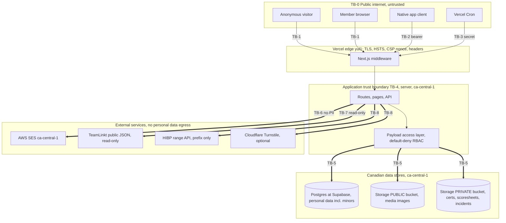

# CMBA Connect, STRIDE Threat Model and Data Flow Diagram

Status: living document, S4 evidence artifact. This is the threat model and textual
data flow diagram that the required external reviews (penetration test, security
review, Privacy Impact Assessment) consume. It is the companion to
`docs/SECURITY.md` (the control matrix) and
`cmba-backend-build/docs/DATA_RESIDENCY_AND_COMPLIANCE.md` (the residency and
PIPEDA mapping).

Every mitigation below is either marked "in place" with a pointer to the file that
implements it, or marked "planned" where the work is not yet built. Where the
control matrix and this model disagree, the code is the source of truth.

---

## 1. System overview and components

CMBA Connect is one Next.js 15 application with Payload CMS 3 running inside it (one
app, one deploy). It owns people development (profiles, certifications, pathways,
training) and competition operations (scheduling, scores, standings, officials,
incidents), plus the public website content. TeamLinkt stays the league system of
record for registration and the official schedule and standings feed; CMBA Connect
reads from it and never writes to it.

### Components and processes

- **Public website (Next.js frontend).** Server-rendered marketing and content
  pages built from Payload `Pages` blocks, announcements, and the TeamLinkt-backed
  schedule and standings views. Anonymous traffic. Includes the one public
  unauthenticated form, `/game-report`.
- **Payload admin panel (`/admin`).** Staff console for super admins and club
  admins: user directory, certification verification, compliance dashboard,
  competition management, content editing, and the append-only audit and consent
  views. Authenticated with Payload's httpOnly cookie session.
- **Authenticated member area (`/account`, `/compliance`, `/manage`, `/rep`).**
  Logged-in members manage their own profile, consents, certificate uploads and
  downloads, and (for team reps) score reporting. A middleware presence gate
  redirects to `/login` when the session cookie is absent; real authorization runs
  server-side per page.
- **Native app API (`/api/v1`).** Versioned JSON API for the native iOS and Android
  apps. Bearer-token auth (`Authorization: JWT <token>`), not browser cookies, so
  it is outside browser CORS. Covers login, refresh, logout, games, score report,
  confirm, dispute, scoresheet upload, standings, brackets, announcements, device
  registration, ICS feeds, the `me` endpoints, and the admin sub-API.
- **Payload REST and GraphQL (`/api/[...slug]`, `/api/graphql`).** Payload's own
  endpoints, governed by the same per-collection access functions as the admin
  panel.
- **Background jobs (Vercel Cron).** Five scheduled routes under `/api/cron`:
  certification reminders, weekly retention review, score reminders, nightly
  standings rebuild, and the TTL sweep that ages out idempotency, rate-limit, and
  challenge rows. All gated by `CRON_SECRET`.

### Data stores and external services

- **Postgres (Supabase, `ca-central-1`, Montréal).** The primary database. Payload
  connects through `@payloadcms/db-postgres`; migrations are the single source of
  truth (`push: false`). Encrypted at rest by Supabase.
- **Object storage (Supabase Storage, S3-compatible, `ca-central-1`).** Two logical
  buckets. The **public** bucket serves images for the `Media` collection directly
  (Payload access control disabled there on purpose). The **private** bucket holds
  certificate files, scoresheet photos, and incident photos, with Payload access
  control kept ON so every download is access-checked and never public. See
  `src/payload.config.ts` plugins block.
- **Email (AWS SES, `ca-central-1`).** Transactional mail over SMTP when
  `SES_SMTP_HOST` is set; otherwise nodemailer's `jsonTransport` (no network) so dev
  and build never send. Email bodies carry no PII; notifications link reviewers into
  the admin panel.
- **Hosting (Vercel, `yul1`, Montréal).** Pinned to Montréal in `vercel.json`
  (`"regions": ["yul1"]`). Terminates TLS and emits HSTS in production.
- **TeamLinkt integration (read-only).** `src/lib/teamlinkt.ts` (`server-only`)
  fetches undocumented public league JSON endpoints server-side, caches results for
  an hour with `unstable_cache`, and falls back to TeamLinkt's official iframe on
  any failure. It never invents data: a failed or garbage response returns an empty
  list. No credentials and no write path.
- **Cloudflare Turnstile (optional).** Bot challenge on the public game-report form,
  active only when configured (`isTurnstileEnabled()`).
- **Have I Been Pwned range API (HIBP).** Breached-password screening via
  k-anonymity: only a 5-character SHA-1 prefix leaves the server, with Add-Padding,
  and the check fails open. `src/lib/security/hibp.ts`.

### External actors

Anonymous visitor; registered member (participant, coach, official); team rep;
guardian of a minor; club admin; super admin; native app client; Vercel Cron;
TeamLinkt (upstream data source); the email recipient's mail provider.

---

## 2. Textual data flow diagram with trust boundaries

Notation: `==>` crosses a trust boundary, `-->` stays inside one. Each boundary is
labelled TB-n. The residency assertion (all personal data stored and processed in
Canada) is called out at each store.

```
                         ┌──────────────────────── TB-0: Public internet (untrusted) ────────────────────────┐
   Anonymous visitor  ===TB-1==>  [Vercel edge, yul1]  --TLS terminate, HSTS, CSP nonce, security headers-->
   Member (browser)   ===TB-1==>  [Next.js + Payload, yul1 functions]
   Native app client  ===TB-2==>  [/api/v1 bearer-token API]
   Vercel Cron        ===TB-3==>  [/api/cron/* , CRON_SECRET]
                         └──────────────────────────────────────────────────────────────────────────────────┘

  ── Inside the application trust boundary (TB-4: server-side, ca-central-1 / yul1) ──

  [Next.js middleware]  --nonce + headers, session-presence gate-->  [Route / page / Payload op]
        │
        ├── public page  --local API (in-process)-->  [Payload access layer: default-deny RBAC]
        │
        ├── /account, /manage, /rep  --payload.auth() + role checks-->  [Payload access layer]
        │
        ├── /admin (cookie session)  --MFA enforced for admins-->  [Payload access layer]
        │
        └── /api/v1 (JWT bearer)  --auth helper-->  [Payload access layer]

  [Payload access layer]  ==TB-5==>  [Postgres @ Supabase ca-central-1]   (PERSONAL DATA, incl. minors; encrypted at rest)
  [Payload access layer]  ==TB-5==>  [Storage @ Supabase ca-central-1]
                                       ├── PUBLIC bucket: Media images (no personal-doc content)
                                       └── PRIVATE bucket: certificate files, scoresheet photos (minors), incident photos
                                            (access-checked downloads only; EXIF/GPS stripped on upload)

  [Server code]  ==TB-6==>  [AWS SES ca-central-1]   (no PII in body; links into /admin or portal)
  [Server code]  ==TB-7==>  [TeamLinkt public JSON]  (READ-ONLY, no creds, no personal data sent; empty on failure)
  [Server code]  ==TB-8==>  [HIBP range API]         (5-char SHA-1 prefix only; full password never leaves; fail-open)
  [Server code]  ==TB-8==>  [Cloudflare Turnstile]   (challenge token verification only; optional)
```

The same flow as a rendered diagram (thick arrows cross a trust boundary):



### Where personal data flows, and the residency assertion

- **Account and profile data** (name, preferred name, pronouns, phone, date of
  birth, emergency contact, club, roles, consents, guardian details for minors) is
  collected at signup or in `/account`, validated by the Users hooks, and stored in
  **Postgres at Supabase `ca-central-1`**. Date of birth derives the `isMinor` flag
  on every save (`deriveIsMinor`).
- **Minors' data** follows the guardian-managed flow: an under-18 account stays
  `pending` until a guardian confirms (`guardianFlow`,
  `sendGuardianConfirmation`). Minors' raw certificate and scoresheet documents live
  in the **private** bucket and are readable only by the owner and super admins; club
  admins see derived compliance status, never the raw file.
- **Certificate documents** upload through `/account`, stream to the **private**
  Supabase bucket (`disableLocalStorage: true`, no serverless local copy), and
  download only through Payload's access-checked endpoint gated by
  `readOwnerOrSuperAdmin`.
- **Scoresheet photos** (often photographs of youth game sheets) upload through
  `/api/v1/uploads/scoresheet`, have **EXIF and GPS stripped before storage**
  (`stripImageMetadata` in the `beforeOperation` create hook), stream to the
  **private** bucket, and are readable by the owner or a currently-verified member of
  either team on the linked game. The game backref is server-forced and validated so
  a photo cannot be repointed at a stranger's game.
- **Consent records** are written append-only to `ConsentRecords` (super-admin read
  only) on every initial consent and re-consent.
- **Privileged actions** write append-only rows to `AuditLog`.
- **Engagement ledgers** (`XpEvents`, `BadgeAwards`) are append-only, system-write
  only: collections deny all API writes and the award engine inserts via
  `overrideAccess`; `beforeChange`/`beforeDelete` block edits even for server calls.
  `Streaks` is a mutable cache written only by the streak-rollup cron. `Recognitions`
  are created pending and surface only after coach/admin approval. These ledgers ship
  dormant behind `FEATURE_GAMIFICATION_LEDGER` (default off).
- **Email** to members and reviewers goes through **AWS SES `ca-central-1`** with no
  PII in the body.

Residency assertion: every store that holds personal data (Postgres, both Storage
buckets, SES) is pinned to `ca-central-1`, and compute is pinned to `yul1`. The only
egress that leaves Canada is the HIBP prefix lookup (which contains no personal data,
only a 5-character hash prefix), the optional Turnstile token verification, and the
read-only TeamLinkt fetch (which sends no personal data). Residency is satisfied;
full data sovereignty is not claimed, because the providers are US-headquartered and
may be subject to US legal process (documented in the residency addendum).

---

## 3. Assets and data classification

| Asset | Examples | Classification | Where it lives |
| --- | --- | --- | --- |
| Minors' personal data | Under-18 profiles, guardian contact, age group | Highly sensitive (children) | Postgres `ca-central-1` |
| Certificate documents | NCCP/RAMP PDFs, criminal-record-check evidence | Highly sensitive | Private Storage bucket `ca-central-1` |
| Scoresheet photos | Photos of paper score sheets (may show youth) | Sensitive | Private Storage bucket `ca-central-1` |
| Incident photos and reports | GameIncidents, IncidentFiles, GameReports | Sensitive | Postgres + private bucket |
| Adult member PII | Name, DOB, phone, emergency contact, email | Confidential | Postgres `ca-central-1` |
| Consent records | Versioned acceptance, IP, timestamps | Confidential, immutable | Postgres `ca-central-1` |
| Authentication secrets | Password hashes, TOTP secrets, passkey keys, recovery codes, refresh tokens | Secret (never serialized) | Postgres `ca-central-1` |
| Audit log | Privileged-action history | Confidential, append-only | Postgres `ca-central-1` |
| Engagement ledgers | `XpEvents`, `BadgeAwards` (may describe a minor's activity) | Confidential, append-only, owner+admin read | Postgres `ca-central-1` |
| Recognitions | Moderated shout-outs/awards, free-text, may name a minor | Sensitive (youth), pending-until-approved | Postgres `ca-central-1` |
| Challenge submissions | Result + optional video clip (may show a minor) | Sensitive when a clip is attached | Postgres + private bucket `ca-central-1` |
| Roles and RBAC config | `roles`, verification stamps, `legalHold` | Confidential, admin-write only | Postgres `ca-central-1` |
| Platform secrets | `PAYLOAD_SECRET`, `DATABASE_URL`, `S3_*`, SES creds, `CRON_SECRET` | Secret | Vercel env, not in repo |
| Public content | Pages, announcements, Media images | Public | Postgres + public bucket |
| TeamLinkt feed data | Schedule, standings | Public (third-party) | Cached in-process |

No payment data and no SIN are collected; payment and registration stay in
TeamLinkt (data minimization, per the residency addendum).

---

## 4. STRIDE by trust boundary

Each table lists the threat, then the concrete mitigation in place (with a file
pointer) or the planned status. "Default-deny RBAC" throughout refers to
`src/access/index.ts`: collections opt into access explicitly and sensitive fields
are locked to admins.

### TB-1: Browser to web app (anonymous and member, cookie sessions)

| STRIDE | Threat | Mitigation |
| --- | --- | --- |
| Spoofing | Session forgery, request from a hostile origin | In place: Payload httpOnly, `Secure`, `SameSite=Lax` cookies; CSRF check and CORS locked to `trustedOrigins` with no wildcard-plus-credentials (`payload.config.ts`); login lockout after 5 attempts for 10 minutes (`Users.auth`). |
| Tampering | Injected scripts, request tampering, clickjacking | In place: strict nonce-based CSP minted per request in `src/middleware.ts` with `strict-dynamic`; `frame-ancestors 'self'` plus `X-Frame-Options: SAMEORIGIN`; nosniff, Referrer-Policy, Permissions-Policy, COOP (`src/lib/security/headers.ts`). |
| Repudiation | User denies a privileged change | In place: append-only `AuditLog` for privileged actions; `ConsentRecords` append-only for consent; Payload version history. |
| Information disclosure | Reading another member's data; stack traces | In place: default-deny RBAC; `safeClientError` strips internal detail (`src/lib/api/handler.ts`); CSP report sink swallows and 204s. |
| Denial of service | Abuse of the public game-report form | In place: honeypot, durable per-IP (5 / 10 min) and global (60 / 10 min) rate limit keyed on a hashed IP, plus optional Turnstile (`GameReports.ts`, `botChallenge.ts`, `rateLimit.ts`). Note: framework-level DoS advisories are tracked as residual risk in section 5. |
| Elevation of privilege | Self-promoting roles; editing read-only fields | In place: `roles`, `status`, `legalHold`, and verification stamps are `superAdminFieldOnly`; the middleware gate is presence-only and real checks run server-side via `payload.auth()`. |

### TB-2: Native app to `/api/v1` (bearer tokens)

| STRIDE | Threat | Mitigation |
| --- | --- | --- |
| Spoofing | Stolen or replayed token | In place: short-lived access JWT (2h) sent as `Authorization: JWT`; long-lived refresh token stored HASHED and rotated on every use, with reuse detection that revokes the whole token family (`RefreshTokens.ts`, `/api/v1/auth/refresh/route.ts`). |
| Tampering | Repointing an upload at another game; double-counting a retried report | In place: server-forced, validated game backref on scoresheet upload (`ScoresheetFiles.ts`); idempotency via the `Idempotency-Key` header, unique on (key, scope), same key from a different user rejected 403, store outage fails closed 503 (`IdempotencyKeys.ts`). |
| Repudiation | Disputed score finalize or override | In place: `AuditLog` rows for game finalize, official assign, import commit and undo, admin override (append-only, enforced at access layer plus hooks). |
| Information disclosure | Reading another team's scoresheet | In place: per-request read scope resolved from the requester's CURRENT verified memberships, so an unverified rep loses access immediately (`ScoresheetFiles.ts readScoresheet`). |
| Denial of service | Endpoint flooding, weak-gym retries | In place: durable rate limiter wraps report, confirm, import, membership self-claim, and ICS (`RateLimitHits.ts`). Planned: per-token API-wide rate limiting and quota tuning land in S3. |
| Elevation of privilege | Calling admin sub-API as a member | In place: `/api/v1/admin/*` routes run the same default-deny RBAC; admin-only fields are `superAdminFieldOnly`. |

### TB-3: Vercel Cron to `/api/cron/*`

| STRIDE | Threat | Mitigation |
| --- | --- | --- |
| Spoofing | Forged cron trigger | In place: `Authorization: Bearer <CRON_SECRET>`; if `CRON_SECRET` is unset the route REJECTS rather than skipping the check (`src/lib/cron.ts`). |
| Tampering / EoP | Cron used to escalate | In place: cron routes use scoped server logic, not a client identity; retention erasure honors the `legalHold` flag. |
| Repudiation | Disputed automated erasure | In place: cron actions are logged for audit (certification reminders, retention review). |
| Denial of service | Long-running job | Partly in place: TeamLinkt fetches have a 12s abort and hourly cache; broader job timeouts to be confirmed in S3. |

### TB-4: Internal app to Payload access layer

| STRIDE | Threat | Mitigation |
| --- | --- | --- |
| Tampering | A server call bypassing history controls with `overrideAccess` | In place: `AuditLog` and `ConsentRecords` block writes at BOTH the access layer and in `beforeChange`/`beforeDelete` hooks; `overrideAccess` bypasses access functions but not hooks, so append-only holds even for server calls (`AuditLog.ts`). |
| Information disclosure | Secret fields serialized to a client | In place: password hash never overridden (Payload PBKDF2); TOTP secret, passkey public key and counter, recovery-code hashes, refresh-token hashes, and `mfa.lastVerifiedAt`/`sessionMeta` all have `read: () => false` or live in deny-all collections (`MfaTotp.ts`, `WebauthnCredentials.ts`, `RecoveryCodes.ts`, `RefreshTokens.ts`, `Users.ts`). |
| Elevation of privilege | Minting an MFA-cleared session without MFA | In place: per-session assurance (`aal`) lives in `sessionMeta`, written only server-side via `overrideAccess`; admins are force-enrolled in MFA (`enforceMfaRequired`); coarse `mfa.enrolled`/`required` flags are read-only and `saveToJWT`. |
| Tampering | A participant self-awarding a "verified" badge or XP | In place: `XpEvents`/`BadgeAwards` deny all API writes and the `verified`/`counts` fields are `superAdminFieldOnly`; only the engine mints events via `overrideAccess`, and it enforces the `verified <=> meaningful` invariant (fail-closed) so a verification-required badge can only be earned from verified XP. A recognition is created pending with `nominatedBy`/`moderationStatus` server-pinned; nothing surfaces until coach/admin approval. |
| Information disclosure | A minor exposed through a leaderboard, player card, or recognition | In place: every engagement collection is owner+admin read; non-owner display uses the privacy-safe name; leaderboard/recognition surfacing of a minor is gated on guardian consent (`appearOnLeaderboard`/`recognitionSurfacing`). |

### TB-5: App to Supabase Postgres and Storage (`ca-central-1`)

| STRIDE | Threat | Mitigation |
| --- | --- | --- |
| Spoofing | Unauthorized DB or bucket access | In place: credentials only in Vercel env, never in repo (`.env` gitignored, gitleaks in CI); production refuses to boot with the dev placeholder secret (`payload.config.ts`). |
| Tampering | Direct object overwrite, public bucket exposure | In place: private bucket keeps Payload access control ON (downloads access-checked, never public); private uploads set `disableLocalStorage: true`; ownership is server-forced in `beforeChange`. |
| Information disclosure | Data leaving Canada; downloading another user's file | In place: region pinned to `ca-central-1`, encrypted at rest; private downloads gated by owner/admin or verified-membership rules; EXIF/GPS stripped from photos. |
| Denial of service | Connection exhaustion | Partly in place: Payload Postgres pool; broader connection and query limits to be validated under load in S3. |
| Elevation of privilege | RLS-bypass via a broad DB role | Planned: least-privilege DB credential is specified in the residency addendum and is an operator provisioning item; access control is currently enforced in the app layer (the stated security boundary). |

### TB-6: App to AWS SES (`ca-central-1`)

| STRIDE | Threat | Mitigation |
| --- | --- | --- |
| Information disclosure | PII leaking in email bodies | In place: notification bodies carry no PII and link into `/admin` or the portal (`GameReports.ts` afterChange). |
| Spoofing | Look-alike sender, spoofed mail | Partly in place: SES over SMTP with `requireTLS`; SPF/DKIM/DMARC domain authentication is an operator provisioning item (SES still to be provisioned per the project notes). |
| Tampering / DoS | Mail-injection, send floods | In place: server controls all `sendEmail` calls; the public form that triggers mail is rate-limited and bot-challenged. |

### TB-7: App to TeamLinkt (read-only)

| STRIDE | Threat | Mitigation |
| --- | --- | --- |
| Tampering | Poisoned or malformed upstream data rendered as truth | In place: `server-only` module; any failure or garbage response returns `[]`; pages fall back to TeamLinkt's official iframe; HTML-in-cell values are parsed defensively. |
| Information disclosure | Leaking our data to the upstream | In place: requests are outbound reads only with no credentials and no personal data in the request. |
| Denial of service | Slow or unavailable upstream stalling our pages | In place: 12s abort on the fetch and hourly `unstable_cache`, so an outage does not block rendering. |

### TB-8: App to HIBP and Turnstile (egress, no personal data)

| STRIDE | Threat | Mitigation |
| --- | --- | --- |
| Information disclosure | A password leaking to a third party | In place: k-anonymity, only a 5-character SHA-1 prefix leaves the server, Add-Padding on, the full password never leaves (`src/lib/security/hibp.ts`). |
| Denial of service | HIBP or Turnstile outage blocking signup | In place: HIBP screening fails open; Turnstile is optional and only active when configured. |
| Spoofing | Forged Turnstile pass | In place: tokens are verified server-side against Cloudflare before the submission is accepted (`verifyTurnstile`). |

---

## 5. Residual risks

These are known and accepted for the current pre-public-registration state, with
owners. They must be closed (or formally re-accepted) before public registration
launch.

1. **Framework-transitive dependency advisories (accepted, pending upgrade).**
   `npm audit` reports high/critical advisories entirely inside framework packages:
   `next` (DoS, middleware/proxy bypass, SSRF in image optimization), `nodemailer`,
   and `undici`, pulled in via Payload 3.85.1 and Next 15.3.9. They are baselined in
   `.audit-allowlist.json` (11 IDs as of 2026-06-29) so a newly disclosed,
   un-triaged advisory still fails CI. Mitigations that reduce exposure today: strict
   CSP and security headers, CORS/CSRF lockdown, and the fact that there are no
   public accounts yet. Owner: operator. Action: upgrade Next.js to the latest
   patched 15.x and Payload to a compatible release, verify on a Vercel preview, then
   shrink the allowlist. Required before launch and an input to the pentest.

2. **Independent penetration test not yet done.** A third-party web and API
   penetration test, with findings remediated, is required before public
   registration. Not satisfiable by code (`docs/SECURITY.md`).

3. **Privacy Impact Assessment not yet done.** A PIA under PIPEDA and Alberta PIPA,
   covering minors' data, is required and must be kept current. Not satisfiable by
   code.

4. **Signed Data Processing Agreements and processor register.** DPAs with Supabase,
   AWS, and Vercel, plus a current processor and sub-processor register, are
   required. Owner: operator / Privacy Officer.

5. **SES provisioning and email authentication.** AWS SES is still to be provisioned;
   until then mail uses `jsonTransport` (no send). SPF/DKIM/DMARC on the sending
   domain are an operator item before any production sends.

6. **Least-privilege database credential.** The app currently enforces authorization
   at the Payload access layer (the stated boundary). A least-privilege DB role and
   in-region tested restore are operator provisioning items from the residency
   addendum, not yet confirmed in this repo.

7. **Residency vs sovereignty.** Data residency in `ca-central-1` and `yul1` is in
   place, but the providers are US-headquartered and may be subject to US legal
   process (for example the CLOUD Act). This is residency, not full sovereignty, and
   is a documented, board-level acceptance decision, not a code control.

8. **Some hardening is staged, not built.** Per `docs/SECURITY.md`, S2 (authorization
   and application hardening completion), S3 (API security, monitoring, incident
   readiness), and S4 (children's-data readiness and evidence) are partly in place or
   planned. API-wide per-token rate limiting, broader job timeouts, and the
   `style-src 'unsafe-inline'` removal are explicitly deferred.

This document is reviewed and updated as each security phase lands and after every
external assessment.
